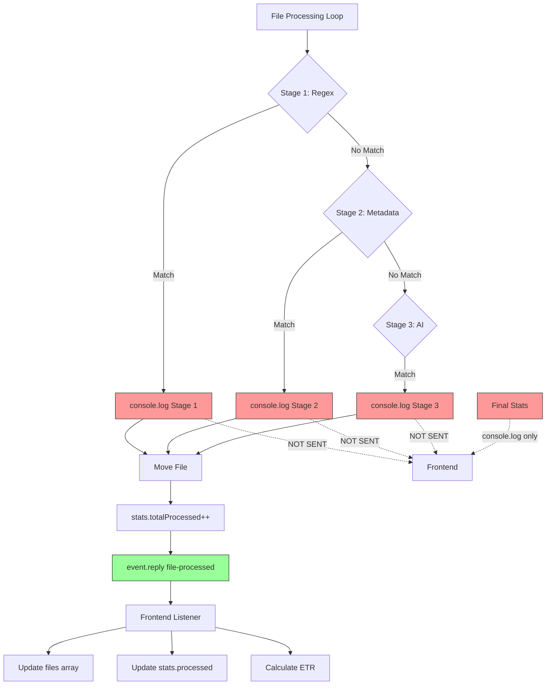

# NeuroSort Data Flow & Broken Pipeline Analysis

## Overview

This document provides a comprehensive analysis of all data generation, transmission, and display mechanisms in the NeuroSort application, identifying where real-time data updates fail and why the frontend does not receive live data.

---

## 1. Backend Data Generation & Logging

### 1.1 Console Logging (Background Data)

The backend generates extensive console logs that are **NOT transmitted to the frontend**:

#### Main Process ([main.js](file:///c:/code/NeuroSort/src/main/main.js))

| Location | Log Type | Purpose | Transmitted? |
|----------|----------|---------|--------------|
| Line 73 | `console.log('Starting sort for:', folderPath)` | Sort initialization | ❌ No |
| Line 261 | `console.log('[v2.0] processDirectory called for:', folderPath)` | Directory processing start | ❌ No |
| Line 263 | `console.log('[v2.0] Files found:', files.length)` | File count | ❌ No |
| Line 285 | `console.log('[v2.0] Valid files to process:', totalFiles)` | Valid file count | ❌ No |
| Line 287 | `console.log('[v2.0] Sent processing-start event')` | Event confirmation | ❌ No |
| Line 297 | `console.log('[v2.0] Processing:', filename)` | Current file | ❌ No |
| Line 318 | `console.log('[Stage 1 ✓] ${filename} -> ${classification.folder}')` | Stage 1 classification | ❌ No |
| Line 326 | `console.log('[Stage 2 ✓] ${filename} -> ${classification.folder}')` | Stage 2 classification | ❌ No |
| Line 336 | `console.log('[Stage 3 ✓] ${filename} -> ${classification.folder}')` | Stage 3 classification | ❌ No |
| Lines 422-426 | `console.log('[v2.0 Statistics]')` + funnel stats | Final statistics | ❌ No |

#### ModelManager ([ModelManager.js](file:///c:/code/NeuroSort/src/main/ModelManager.js))

- Lines 17, 26, 32, 54, 86, 91, 107, 150: Model wake/sleep operations
- **None of these logs are transmitted to frontend**

#### Stage Modules

- **RegexGuard.js**: No console logging (silent classification)
- **MetadataAnalyst.js**: Error logging only (line 40) - not transmitted
- **taxonomy.js**: No logging (configuration module)

### 1.2 IPC Events (Transmitted Data)

The following events are **transmitted from backend to frontend**:

| Event Name | Source | Data Structure | Frequency | Purpose |
|------------|--------|----------------|-----------|---------|
| `system-stats` | [main.js:56](file:///c:/code/NeuroSort/src/main/main.js#L56) | `{ memory: string, port: string }` | Every 2 seconds | System resource display |
| `log-update` | [main.js:74](file:///c:/code/NeuroSort/src/main/main.js#L74), 309, 373, 395, 401, 428, 434, 443, 446 | `{ msg: string, type: 'info'|'error'|'success'|'warning'|'process' }` | On events | Log messages |
| `processing-start` | [main.js:286](file:///c:/code/NeuroSort/src/main/main.js#L286) | `{ total: number }` | Once per sort | Total file count |
| `file-processed` | [main.js:396](file:///c:/code/NeuroSort/src/main/main.js#L396) | `{ name, type, size, dest, reason, stage }` | Per file | File completion |
| `processing-complete` | [main.js:451](file:///c:/code/NeuroSort/src/main/main.js#L451) | (no data) | Once at end | Processing finished |
| `download-progress` | [main.js:144](file:///c:/code/NeuroSort/src/main/main.js#L144), 212 | `{ percent: number }` | During downloads | Download progress |

---

## 2. Frontend Data Display

### 2.1 IPC Event Listeners

All IPC listeners are configured in [App.jsx](file:///c:/code/NeuroSort/src/renderer/App.jsx):

| Listener | Line | Component | Purpose | Status |
|----------|------|-----------|---------|--------|
| [onLog](file:///c:/code/NeuroSort/src/shared/preload.js#6-7) | 31 | App (root) | Global log display | ✅ Working |
| [onProcessingComplete](file:///c:/code/NeuroSort/src/shared/preload.js#7-8) | 34 | App (root) | Completion trigger | ✅ Working |
| [onSystemStats](file:///c:/code/NeuroSort/src/shared/preload.js#18-19) | 37 | App (root) | Status bar display | ✅ Working |
| [onDownloadProgress](file:///c:/code/NeuroSort/src/shared/preload.js#16-17) | 206, 244, 262 | ModelLoader | Download progress bars | ✅ Working |
| [onProcessingStart](file:///c:/code/NeuroSort/src/shared/preload.js#14-15) | 437 | ProcessingDashboard | Total file count | ✅ Working |
| [onFileProcessed](file:///c:/code/NeuroSort/src/shared/preload.js#13-14) | 444 | ProcessingDashboard | **Real-time file updates** | ✅ Working |

### 2.2 Frontend Display Components

#### Global Displays (Always Visible)

1. **Status Bar** ([App.jsx:105-123](file:///c:/code/NeuroSort/src/renderer/App.jsx#L105-123))
   - Memory usage: ✅ Real-time (via `system-stats`)
   - Port number: ✅ Real-time (via `system-stats`)
   - AI engine status: ✅ Real-time (based on step state)

2. **Global Log Overlay** ([App.jsx:126-133](file:///c:/code/NeuroSort/src/renderer/App.jsx#L126-133))
   - Shows last 50 logs
   - Updates: ✅ Real-time (via `log-update`)
   - Located: Bottom-right corner

#### ProcessingDashboard Component ([App.jsx:423-562](file:///c:/code/NeuroSort/src/renderer/App.jsx#L423-562))

| Display Element | Data Source | Real-time? | Issue |
|----------------|-------------|------------|-------|
| **Files Processed Count** (line 489) | `stats.processed` state | ✅ Real-time | Updates on `file-processed` event |
| **Total Files Count** (line 489) | `stats.total` state | ✅ Real-time | Set by `processing-start` event |
| **Estimated Time Remaining** (line 493) | Calculated from `stats.etr` | ✅ Real-time | Calculated per file |
| **Live Activity Feed** (lines 506-540) | `files` state array | ✅ Real-time | Updates on `file-processed` event |
| **LLM Context Window** (lines 544-558) | Simulated from `files[0]` | ⚠️ **FAKE DATA** | Shows simulated AI thinking |

---

## 3. Broken Pipelines & Missing Data Flow

### 3.1 ❌ CRITICAL ISSUE: Missing Real-time File Processing Logs

**Problem**: The detailed console logs showing which stage (Regex/Metadata/AI) classified each file are NOT transmitted to the frontend.

**Evidence**:
- Backend logs extensively (lines 318, 326, 336 in main.js)
- Frontend receives only generic `log-update` messages
- Stage-specific progress is invisible to users

**Impact**: 
- Users cannot see the v2.0 funnel statistics in real-time
- No live breakdown of Regex vs Metadata vs AI classifications
- Frontend "LLM Context Window" uses **fake simulated data** instead of real AI decision logs

### 3.2 ❌ ISSUE: File Processing Count Discrepancy

**Problem**: The `stats.totalProcessed` counter in the backend does NOT align with `file-processed` events.

**Evidence**:
- [main.js:394](file:///c:/code/NeuroSort/src/main/main.js#L394) - `stats.totalProcessed++` happens INSIDE processNext
- [main.js:396](file:///c:/code/NeuroSort/src/main/main.js#L396) - `event.reply('file-processed', fileData)` happens AFTER stats increment
- [main.js:375](file:///c:/code/NeuroSort/src/main/main.js#L375) - Duplicate files cause `stats.totalProcessed++` but NO `file-processed` event (early return)

**Impact**:
- Frontend counts only moved files
- Backend counts all processed files (including deleted duplicates)
- Statistics mismatch between frontend and backend

### 3.3 ⚠️ ISSUE: No Progress Events During Processing

**Problem**: Between `processing-start` and `file-processed` events, there's no intermediate progress data.

**Evidence**:
- Files are processed in batches (CONCURRENCY_LIMIT = 5)
- No event emitted when a file starts processing
- Frontend cannot show "currently processing" status for concurrent files

**Current Workaround**: 
- Frontend uses `currentFile` state (line 427) but never receives data for it
- The UI shows "Processing..." but filename is never populated

### 3.4 ⚠️ ISSUE: Stage Funnel Statistics Only at End

**Problem**: v2.0 funnel statistics (Stage 1/2/3 breakdown) are only logged at completion, not streamed.

**Evidence**:
- [main.js:422-426](file:///c:/code/NeuroSort/src/main/main.js#L422-426) - Statistics logged to console only
- [main.js:428-431](file:///c:/code/NeuroSort/src/main/main.js#L428-431) - Only a summary string sent via `log-update`, not structured data
- Frontend has no way to display real-time funnel chart

**Impact**:
- Users cannot see the efficiency of each stage in real-time
- No visual representation of the "90% Regex, 8% Metadata, 2% AI" claim

### 3.5 ✅ WORKING: Real-time File Updates

**Confirmed Working**:
- `file-processed` events ARE being sent (line 396)
- Frontend listener IS configured (line 444)
- Files array IS updating (lines 447-450)
- Console logs confirm reception: `'[App.jsx] ✅ RECEIVED FILE:'`

**Note**: If users report "no real-time updates," the issue may be:
1. Events firing too fast to see
2. Frontend not rendering due to React state issues
3. Files not being processed at all (check Ollama connection)

---

## 4. Data That Exists But Is Not Displayed

### 4.1 Stage Information

**Available**: `fileData.stage` is included in `file-processed` event (line 391)

**Not Displayed**: Frontend shows only `file.reason` (line 526), not `file.stage`

**Opportunity**: Could highlight files by stage color (Regex=green, Metadata=yellow, AI=purple)

### 4.2 Funnel Statistics

**Available**: Backend calculates `stats.stage1Hits`, `stats.stage2Hits`, `stats.stage3Hits`

**Not Transmitted**: Only available as console logs and summary string

**Opportunity**: Send structured stats object periodically or at end

### 4.3 Model Manager Activity

**Available**: ModelManager logs when models wake/sleep (critical for RAM awareness)

**Not Transmitted**: All ModelManager activity is console-only

**Opportunity**: Send `model-status` events when model loads/unloads

### 4.4 Duplicate File Detection

**Available**: Backend detects and deletes duplicates via MD5 hash (line 370-375)

**Partially Transmitted**: Only a warning log `"Duplicate deleted: ${filename}"` (line 373)

**Missing**: No statistics on how many duplicates were found/deleted

---

## 5. Fake Data in Frontend

### 5.1 LLM Context Window (COMPLETELY SIMULATED)

**Location**: [App.jsx:544-558](file:///c:/code/NeuroSort/src/renderer/App.jsx#L544-558)

**Current Behavior**:
```jsx
{files.length > 0 && (
    <>
        <div>prompt &gt; classify_file("{files[0].name}")</div>
        <div> &gt; analyzing metadata...</div>
        <div> &gt; extension: .{files[0].name.split('.').pop()}</div>
        <div> &gt; match_found: {files[0].dest} (Confidence: 98%)</div>
    </>
)}
```

**Reality**: This is fabricated UI text. The actual AI classification happens in [main.js:519-606](file:///c:/code/NeuroSort/src/main/main.js#L519-606) but the prompt/response are never sent to the frontend.

**Impact**: Misleading to users - shows "AI thinking" that never happened

### 5.2 Completion Summary Statistics (HARDCODED)

**Location**: [App.jsx:576-589](file:///c:/code/NeuroSort/src/renderer/App.jsx#L576-589)

**Current Behavior**:
```jsx
<div>10</div> // Files Moved
<div>5</div>  // Categories
<div>0s</div> // Cloud Latency
```

**Reality**: Should show actual `stats.totalProcessed`, unique folder count, and processing time

---

## 6. Recommended Fixes (Not Implemented)

### 6.1 HIGH PRIORITY: Add Structured Progress Events

**Problem**: No detailed progress events during file processing

**Solution**: Add new IPC event `file-processing-status`

**Implementation**:
1. In [main.js:309](file:///c:/code/NeuroSort/src/main/main.js#L309), add:
   ```javascript
   event.reply('file-processing-status', { filename, stage: 'analyzing' });
   ```

2. After stage classification (lines 318, 326, 336), add:
   ```javascript
   event.reply('file-processing-status', { 
     filename, 
     stage: 'classified',
     classification: {
       folder: classification.folder,
       reason: classification.reason,
       stageUsed: classification.stage,
       confidence: classification.confidence
     }
   });
   ```

3. Add listener in [App.jsx](file:///c:/code/NeuroSort/src/renderer/App.jsx) ProcessingDashboard

### 6.2 HIGH PRIORITY: Stream Funnel Statistics

**Problem**: Stage breakdown only available at end

**Solution**: Send `funnel-stats` event after each file or every N files

**Implementation**:
1. In [main.js](file:///c:/code/NeuroSort/src/main/main.js), after line 394, add:
   ```javascript
   if (stats.totalProcessed % 10 === 0) {
     event.reply('funnel-stats', {
       stage1: stats.stage1Hits,
       stage2: stats.stage2Hits,
       stage3: stats.stage3Hits,
       total: stats.totalProcessed
     });
   }
   ```

2. Add visualization component in frontend to display real-time funnel chart

### 6.3 MEDIUM PRIORITY: Fix Duplicate File Counting

**Problem**: Duplicate files counted in backend but not frontend

**Solution**: Include duplicate files in a separate counter

**Implementation**:
1. Add `duplicatesDeleted` counter to stats object
2. Send `file-duplicate-detected` event instead of early return
3. Display duplicate count in frontend stats

### 6.4 MEDIUM PRIORITY: Add Model Status Events

**Problem**: Model wake/sleep invisible to users

**Solution**: Add `model-status` event in ModelManager

**Implementation**:
1. Pass `event` object to ModelManager.wake() and .unload()
2. Emit events: `{ status: 'waking'|'loaded'|'sleeping'|'unloaded', ramUsage: '2GB' }`
3. Display model status indicator in frontend status bar

### 6.5 LOW PRIORITY: Replace Fake LLM Context Window

**Problem**: Simulated AI thinking display

**Solution**: Either remove it or make it display real AI prompts

**Implementation**:
1. In [main.js:classifyWithAI](file:///c:/code/NeuroSort/src/main/main.js#L519), emit:
   ```javascript
   event.reply('ai-log', { type: 'prompt', content: prompt });
   event.reply('ai-log', { type: 'response', content: data.response });
   ```

2. Update frontend to display actual AI logs instead of simulated ones

### 6.6 LOW PRIORITY: Real Completion Statistics

**Problem**: Hardcoded completion summary

**Solution**: Send final statistics with `processing-complete` event

**Implementation**:
1. Change line 451 to:
   ```javascript
   event.reply('processing-complete', {
     totalMoved: stats.totalProcessed,
     totalFolders: uniqueFolders.length,
     processingTime: Date.now() - processingStartTime,
     funnelBreakdown: {
       stage1: stats.stage1Hits,
       stage2: stats.stage2Hits,
       stage3: stats.stage3Hits
     }
   });
   ```

2. Update CompletionSummary component to use real data

---

## 7. Summary of Findings

### ✅ What's Working

1. **Basic IPC Communication**: All core events are firing and being received
2. **Real-time Log Updates**: Global log overlay shows backend messages
3. **File Processing Events**: Each completed file triggers `file-processed` event
4. **System Stats**: Memory and port displayed in real-time
5. **Download Progress**: Model downloads show progress bars

### ❌ What's Broken/Missing

1. **No Stage-Specific Progress**: Can't see which classification stage is being used per file
2. **No Real-time Funnel Stats**: v2.0 architecture stats not visible during processing
3. **No Model Activity Visibility**: Model wake/sleep events not transmitted
4. **Duplicate Counting Mismatch**: Backend and frontend count files differently
5. **Fake UI Elements**: LLM Context Window and Completion Stats are hardcoded

### ⚠️ Where Real-time Updates Fail

**The frontend DOES receive real-time updates for**:
- ✅ System memory/port (every 2 seconds)
- ✅ Log messages (as they occur)
- ✅ File completions (as files finish)
- ✅ Total file count (at start)

**The frontend DOES NOT receive real-time updates for**:
- ❌ Which file is currently being processed
- ❌ Which classification stage is being used
- ❌ Model loading/unloading status
- ❌ Funnel statistics breakdown
- ❌ Duplicate file detection events

---

## 8. Data Flow Diagram



**Legend**:
- 🟢 Green = Data transmitted to frontend
- 🔴 Red = Data only in console logs (not transmitted)
- Dotted lines = Missing data flow

---

## Conclusion

The NeuroSort application **HAS** real-time data updates for basic file processing, but **LACKS** detailed progress information about the v2.0 architecture's classification stages. The backend generates extensive logs about which stage (Regex/Metadata/AI) handles each file, but this critical information never reaches the frontend. Additionally, some UI elements display fake/hardcoded data instead of actual processing statistics.

To achieve true real-time visibility into the classification funnel, the application needs structured IPC events for stage-specific progress, funnel statistics, and model activity.
